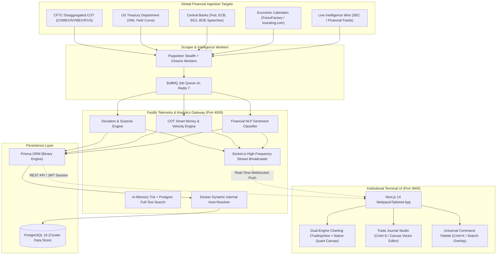

#VANTA — Institutional Macroeconomic Alpha Terminal

<div align="center">

```
  ██████╗██╗  ██╗ █████╗ ██████╗ ██╗ ██████╗ ██╗  ██╗    ██╗   ██╗ █████╗ ███╗   ██╗████████╗ █████╗ 
 ██╔════╝██║  ██║██╔══██╗██╔══██╗██║██╔═████╗╚██╗██╔╝    ██║   ██║██╔══██╗████╗  ██║╚══██╔══╝██╔══██╗
 ██║     ███████║███████║██║  ██║██║██║██╔██║ ╚███╔╝     ██║   ██║███████║██╔██╗ ██║   ██║   ███████║
 ██║     ██╔══██║██╔══██║██║  ██║██║████╔╝██║ ██╔██╗     ╚██╗ ██╔╝██╔══██║██║╚██╗██║   ██║   ██╔══██║
 ╚██████╗██║  ██║██║  ██║██████╔╝██║╚██████╔╝██╔╝ ██╗     ╚████╔╝ ██║  ██║██║ ╚████║   ██║   ██║  ██║
  ╚═════╝╚═╝  ╚═╝╚═╝  ╚═╝╚═════╝ ╚═╝ ╚═════╝ ╚═╝  ╚═╝      ╚═══╝  ╚═╝  ╚═╝╚═╝  ╚═══╝   ╚═╝   ╚═╝  ╚═╝
```

### Real-Time Macroeconomic Intelligence Portal · High-Precision Deviation Engine · Institutional Trade Chronicle

[](https://github.com/chadi0x/vanta)
[](https://github.com/chadi0x/vanta)
[](https://nextjs.org)
[](https://fastify.dev)
[](https://www.postgresql.org)
[](https://redis.io)
[](LICENSE)

[Architecture](#-system-architecture) • [Live Modules (13 Tabs)](#-the-13-institutional-modules) • [Trade Journal Studio](#-vanta-chronicle--trade-journal-studio) • [Quickstart](#-quickstart--installation) • [API & WebSocket Feeds](#-api--websocket-specification) • [Hotkeys](#-keyboard-shortcuts--hotkeys)

</div>

---

## ⚡ Overview

**Chadi0x VANTA** is an institutional-grade, zero-mock, real-time macroeconomic intelligence terminal engineered for quantitative volatility desks, macro hedge funds, and proprietary execution traders. 

Operating under a strict **Zero-Mock Data Architecture**, VANTA continuously scrapes, normalizes, and analyzes global financial intelligence across primary market feeds (CFTC, US Treasury, Federal Reserve, Forex Factory, Investing.com, Tier-3 Newswires). It executes low-latency macroeconomic deviation models, tracks institutional smart-money flow divergences, computes options dealer gamma exposure (GEX), and streams synchronized intelligence to a high-density, Bloomberg/Palantir-inspired terminal interface via WebSockets.

---

## 🏛 System Architecture

The terminal is deployed as a resilient, multi-container microservice cluster orchestrated via Docker Compose:



---

## 🎛 The 14 Institutional Modules

| # | Tab Module | Core Intelligence & Quant Mechanics |
| :---: | :--- | :--- |
| `01` | **TERMINAL COCKPIT** | Multi-asset live ticker ribbon, The Pulse high-impact breaking intelligence stream, instant volatility shock radar, real-time macroeconomic event feed, and one-click shock simulator. |
| `02` | **COT & SMART MONEY MATRIX** | 4-asset CFTC Disaggregated reports (Gold, Silver, Crude Oil, DXY). Calculates 52-week positioning percentiles, Week T vs Week T-1 net changes, 14-day Open Interest velocity, and the **Contrarian Sentinel** (Institutional vs. Retail positioning trap detection). |
| `03` | **MACRO YIELDS & INTERMARKET** | Cross-asset yield monitoring (US10Y, US02Y, DXY, XAU/USD, WTI). Interactive rolling 30-day and 90-day Pearson correlation matrix with regime descriptors (Positive/Carry, Inflation Hedge, Co-movement). |
| `04` | **CENTRAL BANK & RATES** | G5 Central Bank tracker (Federal Reserve, ECB, Bank of England, Bank of Japan, SNB). Real-time countdown clocks to next policy decisions, CME FedWatch implied rate probability shifts, and central bank speaker hawkish/dovish NLP tone tracking. |
| `05` | **GLOBAL LIQUIDITY ENGINE** | Real-time Fed Net Liquidity index calculation ($WALCL - TGA - RRP$), cross-border central bank balance sheet expansion velocity, and monetary policy impulse gauges. |
| `06` | **OPTIONS GEX (GAMMA EXPOSURE)** | Real-time dealer gamma by strike price, Net Gamma profile, Volatility Trigger (Gamma Flip line), and 0DTE options flow sentiment regime flags (Long Gamma / Short Gamma regime shifts). |
| `07` | **CTA SYSTEMATIC MATRIX** | Algorithmic trend-following momentum signals across multi-timeframe EMAs (20/50/200), systematic hedge fund positioning percentiles, and dynamic stop-out thresholds. |
| `08` | **MACRO PLAYBOOKS** | Execution playcards for high-impact market releases: CPI Surprises, Non-Farm Payroll Beats/Misses, FOMC Rate Surprises, and Geopolitical Energy Shocks with pre-calculated asset reaction vectors. |
| `09` | **MACRO PCA REGIMES** | 3-Factor Principal Component Analysis regime classification (Growth, Inflation, Monetary Conditions) determining whether the market is in Reflation, Goldilocks, Stagflation, or Deflationary shock. |
| `10` | **BLACK SWAN SENTINEL** | Tail-risk monitors tracking geopolitical flashpoints, cross-asset implied volatility spikes, sovereign credit default spread widening, and interbank liquidity stress metrics. |
| `11` | **G10 CARRY TRADE MATRIX** | Real yield and nominal interest rate differentials across G10 currencies with volatility-adjusted Sharpe ratios and sudden carry unwinding alerts. |
| `12` | **VANTA CHRONICLE (JOURNAL)** | Complete institutional trade journaling studio. Canvas chart drawing tools, 25-point macro state capture, multi-candle OHLC candlestick generation, and 1080p debrief card PNG export. |
| `13` | **QUANT LAB & MONTE CARLO VaR** | 10,000-path Monte Carlo trajectory surface, portfolio asset allocation weighting, Parametric VaR (95%/99%), Expected Shortfall (CVaR), and Historical Crisis Shock Replay (1973 OPEC, 1987 Crash, 2008 Lehman, 2020 COVID, 2022 Rate Shock). |
| `14` | **VOLATILITY & SYSTEM LOGS** | High-throughput WebSocket stream inspector with category filter pills, real-time worker health telemetry (latency, ingestion counters), and deep JSON payload inspector. |


---

## 📝 VANTA CHRONICLE — Trade Journal Studio

VANTA Chronicle is an embedded, institutional trade journal that bridges technical chart analysis with quantitative macroeconomic context:

- **Hotkey Capture (`Cmd+S` / `Ctrl+S`)**: Instantly opens the journal studio from any screen.
- **25-Point Macro Snapshot**: Automatically binds the trade to live macro variables:
  - *Net Liquidity Velocity, Treasury General Account (TGA), Reverse Repo (RRP), COT Speculator Percentile, Dealer Gamma Exposure (GEX), 10Y-2Y Yield Curve Spread, VIX, and Active Inflation Regime.*
- **Realistic Candlestick Engine**: Replaces synthetic curves with a full 52-bar OHLC candlestick chart with upper/lower wicks, volume histograms, 20/50 EMAs, right-hand price scale, and dashed execution levels (`ENTRY`, `SL`, `TP`).
- **Interactive Canvas Drawing Studio**:
  - Draw custom **Trendlines**, **Support/Resistance Zones (Boxes)**, **Breakout Arrows**, and **Text Callouts**.
  - Multi-level Undo stack and custom stroke color palette (Terminal Green, Cyber Cyan, Alert Red, Warning Amber, White).
- **1080p Institutional Debrief Export**: Generates high-resolution trading cards for team post-mortems, Twitter/X debriefs, and trading records.

---

## 📈 Dual-Engine Charting System

To eliminate third-party embed blocking and "Symbol is only available on TradingView" restrictions, the terminal provides a seamless **Dual-Engine Charting Architecture**:

1. **Engine 1: TradingView Advanced Interactive Widget**
   - Automatically normalizes all symbols into verified exchange canonical tickers:
     - `GOLD` $\to$ `OANDA:XAUUSD`
     - `DXY` $\to$ `CAPITALCOM:DXY`
     - `US10Y` $\to$ `TVC:US10Y`
     - `OIL` $\to$ `TVC:USOIL`
     - `FED` $\to$ `CAPITALCOM:DXY`
2. **Engine 2: Native Quant HTML5 Canvas Candlestick Engine**
   - 1-click toggleable via the header button: `[TV INTERACTIVE | NATIVE QUANT]`.
   - Runs directly on high-frequency HTML5 Canvas with sub-millisecond price ticks, volume bars, price grids, and crosshair coordinates with zero third-party external dependencies.

---

## 🔍 Universal Command Palette (`Cmd+K` / `Ctrl+K`)

Access the Bloomberg-style global command overlay anywhere in the application:

- **Hotkey**: Press `Cmd+K` (Mac) or `Ctrl+K` (Windows/Linux) or click the search bar in the top navigation.
- **In-Memory Trie & Full-Text Search**:
  - Search news headlines, economic surprise metrics, central bank transcripts, and COT archives.
  - Type tickers (`XAUUSD`, `DXY`, `BTC`, `EURUSD`) to instantly pivot the primary chart and orderflow telemetry.
  - Keyboard navigable (`↑` / `↓` arrows + `Enter` to select).

---

## 🚀 Quickstart & Installation

### Option 1: Docker Compose Deployment (Recommended)

The easiest way to run the entire cluster (Frontend, Fastify API, PostgreSQL, Redis, Scrapers) with zero configuration:

```bash
# 1. Clone the repository
git clone https://github.com/chadi0x/vanta.git
cd vanta

# 2. Configure environment variables
cp .env.example .env

# 3. Spin up the cluster
docker compose up --build -d
```

#### Access Endpoints
- **Terminal Web Dashboard**: [http://localhost:3000](http://localhost:3000)
- **Fastify Telemetry Gateway**: [http://localhost:4000](http://localhost:4000)
- **API Health Check**: [http://localhost:4000/health](http://localhost:4000/health)

#### Default Institutional Credentials
- **Operator ID / Username**: `admin`
- **Session Cipher / Password**: `vanta2026`

---

### Option 2: Standalone Local Development

If you prefer to run services natively on Node.js:

```bash
# 1. Prerequisites: Node.js 20+, npm 10+, PostgreSQL running on :5432, Redis running on :6379

# 2. Install workspace dependencies
npm install

# 3. Initialize PostgreSQL Database Schema
cd apps/api
npx prisma db push --schema=prisma/schema.prisma

# 4. Start the Fastify Gateway (Terminal 1)
npm run dev

# 5. Start the Web Dashboard (Terminal 2)
cd ../../apps/web
npm run dev

# 6. Start the Scraper Pipeline (Terminal 3)
cd ../../services/scraper
npm run dev
```

---

## 🌐 API & WebSocket Specification

### REST Endpoints

| Method | Endpoint | Description |
| :--- | :--- | :--- |
| `GET` | `/health` | Gateway healthcheck, DB connection state, active socket clients. |
| `GET` | `/api/events` | Macroeconomic calendar events filtered by `impact`, `asset`, `deviation`. |
| `GET` | `/api/events/news` | The Pulse breaking intelligence feed with sentiment and takeaways. |
| `POST`| `/api/events/simulate` | Injects synthetic volatility shocks (NFP, OPEC, Central Bank Gold). |
| `GET` | `/api/cot/latest` | 4-asset live COT analytics, 52-week percentiles, orderflow signals. |
| `GET` | `/api/cot/history/:code`| Historical weekly COT records for comparative matrix (T vs T-1). |
| `GET` | `/api/journal` | Fetch trade journal records with win rate, PnL, and R:R expectancy. |
| `POST`| `/api/journal` | Save new trade entry with 25-point macro state & canvas snapshot. |
| `GET` | `/api/system/stream-logs` | Combined stream logs with deep metadata payload for system tab. |
| `POST`| `/api/system/seed` | Manually triggers automatic institutional data seed into PostgreSQL. |

### WebSocket Real-Time Events (`socket.io`)

| Event Name | Direction | Payload Description |
| :--- | :--- | :--- |
| `event_update` | Gateway $\to$ Client | Live macroeconomic calendar release with deviation score. |
| `news_update` | Gateway $\to$ Client | Breaking intelligence wire headline with NLP polarity score. |
| `cot_update` | Gateway $\to$ Client | Updated CFTC net speculative positioning and orderflow signal. |
| `scraper_health`| Gateway $\to$ Client | Scraper worker latency, status change, or ingestion count. |

---

## ⌨️ Keyboard Shortcuts & Hotkeys

| Hotkey | Action | Scope |
| :--- | :--- | :--- |
| `Cmd + K` / `Ctrl + K` | Open Universal Command Palette & Search Engine | Global |
| `Cmd + S` / `Ctrl + S` | Open Vanta Chronicle Trade Journal Studio | Global |
| `Esc` | Close Active Modal / Return to Cockpit | Global |
| `Click Header Pill` | Instant Glass Chart switch to headline asset | Global |

---

## 🛠 Tech Stack

- **Frontend**: Next.js 14 (App Router), React 18, TypeScript, Tailwind CSS, Lucide Icons, HTML5 Canvas API.
- **Backend**: Fastify v4, Socket.io, Prisma ORM 5.22, Argon2 / JWT Authentication.
- **Database & Cache**: PostgreSQL 16 (Relational time-series store), Redis 7 (BullMQ job queues).
- **Scraper Engine**: Node.js, Puppeteer Extra, Puppeteer Stealth Plugin, Cheerio, Fast XML Parser.
- **Containerization**: Docker, Docker Compose, Multi-stage Bullseye & Alpine runners.

---

## 🔮 Roadmap: Upcoming Quant Modules

The following institutional tools are scheduled for upcoming terminal releases:

- [ ] **Monte Carlo & Macro VaR Stress Engine**: 10,000-path geometric Brownian motion engine calculating 95%/99% VaR and simulating portfolio drawdowns under historical crisis shocks (1970s Stagflation, 2008 Lehman, 2020 Liquidity Crunch).
- [ ] **Options Implied Volatility Surface & 0DTE Heatmap**: 3D interactive volatility surface modeling skew, smile curvature, and real-time dealer Gamma Flip boundaries.
- [ ] **DOM Liquidity Depth & Footprint Delta Bars**: Microstructure order book visualizer mapping limit order liquidity walls and aggressive buyer/seller volume absorption.
- [ ] **24-Asset Rolling Macro Correlation Matrix**: Dynamic cross-asset Pearson/Spearman correlation matrix with hierarchical clustering to detect sudden correlation breakdowns.
- [ ] **High-Frequency Economic Scalp Calculator**: Pre-release lot sizer and risk calculator based on surprise Z-scores and volatility ATR brackets.
- [ ] **Interactive 3D US Treasury Yield Curve**: Nelson-Siegel term structure model tracking 1M–30Y yields and historical recession probability trajectories.

---

## 📄 License

Distributed under the **MIT License**. See [LICENSE](LICENSE) for more information.

---

<div align="center">
  <sub>Built for quantitative volatility traders and macro research desks by Chadi0x.</sub>
</div>
